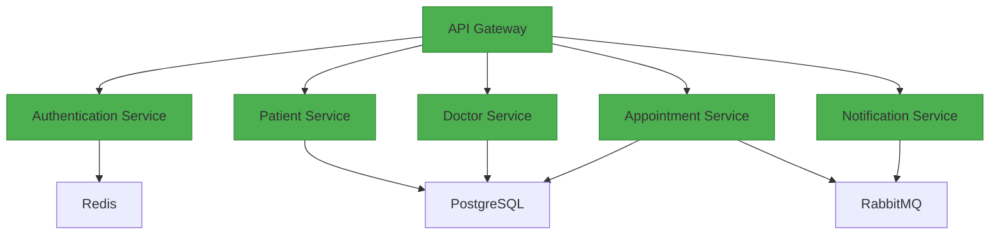

# System Architecture

## Microservices Diagram



## Component Breakdown

1. **API Gateway (FastAPI)**
   - Routes incoming requests
   - Handles rate limiting
   - Manages JWT validation

2. **Authentication Service**
   - OAuth2 password flow
   - JWT token generation
   - Redis session storage

3. **Patient Service**
   - Patient CRUD operations
   - Insurance data management
   - Medical records storage

4. **Doctor Service**
   - Doctor profile management
   - Availability scheduling
   - Specialization tracking

5. **Appointment Service**
   - Conflict detection system
   - Calendar integration
   - Status transitions

6. **Notification Service**
   - Email/SMS notifications
   - RabbitMQ message processing
   - Template management

## Data Flow
1. Client → API Gateway → Service
2. Services ↔ PostgreSQL (ACID transactions)
3. Cross-service communication via RabbitMQ
4. Redis cache for frequent queries

# API_EXAMPLES.http

```markdown
# API Request Examples

### Authentication
```http
POST http://localhost:8000/api/auth/login
Content-Type: application/json

{
  "email": "patient@example.com",
  "password": "securePassword123!"
}
```

### Patient Management
```http
GET http://localhost:8000/api/patients/me
Authorization: Bearer {{token}}
```

### Doctor Availability
```http
POST http://localhost:8000/api/doctors/availability
Authorization: Bearer {{token}}
Content-Type: application/json

{
  "start_time": "2024-03-01T09:00:00",
  "end_time": "2024-03-01T17:00:00",
  "recurring": true
}
```

### Appointment Booking
```http
POST http://localhost:8000/api/appointments
Authorization: Bearer {{token}}
Content-Type: application/json

{
  "doctor_id": "550e8400-e29b-41d4-a716-446655440000",
  "scheduled_time": "2024-03-05T14:30:00",
  "reason": "Annual Checkup"
}
